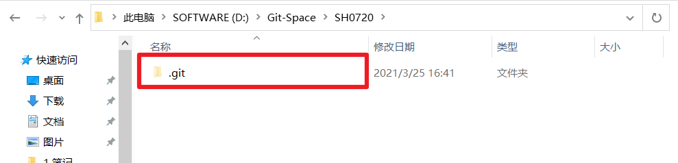
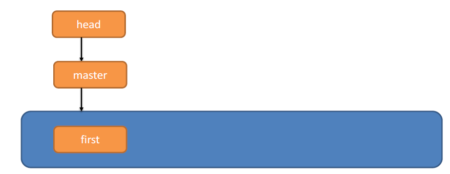
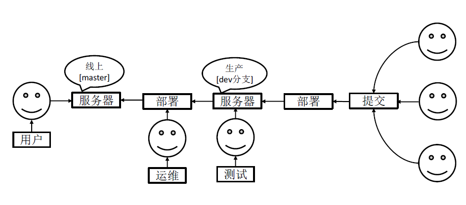
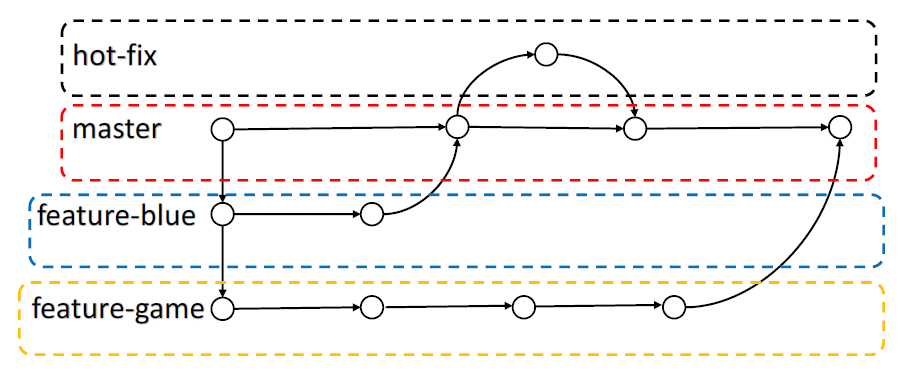
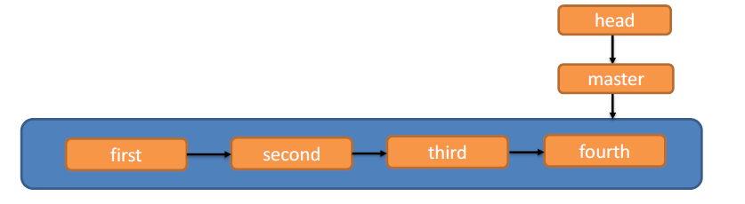

# 第1章 Git概述

# 第2章 Git安装

# 第3章 Git常用命令

​			

| 命令名称                             | 作用           |
| ------------------------------------ | :------------- |
| git config global user.name 用户名   | 设置用户签名   |
| git config --global user.email  邮箱 | 设置用户邮箱   |
| git init                             | 初始化本地库   |
| git status                           | 查看本地库状态 |
| git add 文件名                       | 添加到缓存区   |
| git commit -m "日志信息"  文件名     | 提交到本地库   |
| git reflog                           | 查看历史记录   |
| git reset hard 版本号                | 版本穿梭       |


## 3.1 设置用户签名

### 3.1.1 基本语法

+ git config --global user.name 用户名
+ git config --global user.email 邮箱

### 3.1.2 案例实操

全局范围的签名设置：

```bash
Layne@LAPTOP-Layne MINGW64 /d/Git-Space/SH0720 (master)
$ git config --global user.name Layne
Layne@LAPTOP-Layne MINGW64 /d/Git-Space/SH0720 (master)
$ git config --global user.email Layne@atguigu.com
Layne@LAPTOP-Layne MINGW64 /d/Git-Space/SH0720 (master)
$ cat ~/.gitconfig 
[user]
     name = Layne
     email = Layne@atguigu.com

```

说明：
	签名的作用是区分不同操作者身份。用户的签名信息在每一个版本的提交信息中能够看到，以此确认本次提交是谁做的。Git 首次安装必须设置一下用户签名，否则无法提交代码。
※注意：这里设置用户签名和将来登录 GitHub（或其他代码托管中心）的账号没有任
何关系。

## 3.2 初始化本地库

### 3.2.1 基本语法

git init

### 3.2.2 案例实操

```bash
Layne@LAPTOP-Layne MINGW64 /d/Git-Space/SH0720
$ git init
Initialized empty Git repository in D:/Git-Space/SH0720/.git/

Layne@LAPTOP-Layne MINGW64 /d/Git-Space/SH0720 (master)
$ ll -a total 4
drwxr-xr-x 1 Layne 197609 0 11 月 25 14:07 ./
drwxr-xr-x 1 Layne 197609 0 11 月 25 14:07 ../
drwxr-xr-x 1 Layne 197609 0 11 月 25 14:07 .git/   （.git 初始化的效果，生成 git）

```

### 3.2.3 结果查看



## 3.3  查看本地库状态

### 3.3.1 基本语法

git status

### 3.3.2 案例实操

1. 首次查看（ 工作区没有任何文件）

   ```bash
   Layne@LAPTOP-Layne MINGW64 /d/Git-Space/SH0720 (master)
   $ git status
   On branch master No commits yet
   nothing to commit (create/copy files and use "git add" to track)
   
   ```

   

2. 新增文件（hello.txt）

   ```bash
   Layne@LAPTOP-Layne MINGW64 /d/Git-Space/SH0720 (master)
   $ vim hello.txt
   hello git! hello atguigu! 
   hello git! hello atguigu! 
   hello git! hello atguigu! 
   hello git! hello atguigu! 
   hello git! hello atguigu! 
   hello git! hello atguigu! 
   hello git! hello atguigu! 
   hello git! hello atguigu! 
   hello git! hello atguigu! 
   hello git! hello atguigu! 
   
   ```

3. 再次查看（检测到未追踪的文件）

   ```bash
   Layne@LAPTOP-Layne MINGW64 /d/Git-Space/SH0720 (master)
   $ git status
   On branch master No commits yet
   Untracked files:
   (use "git add <file>..." to include in what will be committed)
   hello.txt
   nothing added to commit but untracked files present (use "git add"
   to track)
   
   ```

## 3.4 添加暂存区

### 3.4.1 基本语法

git add 文件名

### 3.4.2 案例实操

1. 添加到暂存区

```bash
Layne@LAPTOP-Layne MINGW64 /d/Git-Space/SH0720 (master)
$ git add hello.txt
warning: LF will be replaced by CRLF in hello.txt.
The  file  will  have  its  original  line  endings  in  your  working
directory.

```

2. 查看状态（ 检测到暂存区有新文件）

```bash
Layne@LAPTOP-Layne MINGW64 /d/Git-Space/SH0720 (master)
$ git status
On branch master No commits yet
Changes to be committed:
(use "git rm --cached <file>..." to unstage)
new file:  hello.txt

```

## 3.5 提交本地库

### 3.5.1 基本语法

git commit -m "日志信息"  文件名

### 3.5.2 案例实操

1. 提交到本地库

```bash
Layne@LAPTOP-Layne MINGW64 /d/Git-Space/SH0720 (master)
$ git commit -m "my first commit" hello.txt
warning: LF will be replaced by CRLF in hello.txt.
The  file  will  have  its  original  line  endings  in  your  working directory.
[master (root-commit) 86366fa] my first commit
1 file changed, 16 insertions(+)
create mode 100644 hello.txt

```

2. 查看状态（没有文件需要提交）

```bash
Layne@LAPTOP-Layne MINGW64 /d/Git-Space/SH0720 (master)
$ git status
On branch master
nothing to commit, working tree clean

```

## 3.6  修改文件

1. 操作

```bash
Layne@LAPTOP-Layne MINGW64 /d/Git-Space/SH0720 (master)
$ vim hello.txt
hello git! hello atguigu! 2222222222222 hello git! hello atguigu!
hello git! hello atguigu! hello git! hello atguigu! hello git! hello atguigu! hello git! hello 
atguigu! hello git! hello atguigu! hello git! hello atguigu! hello git! hello atguigu! hello git! 
hello atguigu! hello git! hello atguigu! hello git! hello atguigu! hello git! hello atguigu! hello 
git! hello atguigu! hello git! hello atguigu!
hello git! hello atguigu!

```


2. 查看状态( 检测到工作区有文件被修改）

```bash
Layne@LAPTOP-Layne MINGW64 /d/Git-Space/SH0720 (master)
$ git status
On branch master
Changes not staged for commit:
(use "git add <file>..." to update what will be committed)
(use "git checkout -- <file>..." to discard changes in working directory)

modified:  hello.txt
no changes added to commit (use "git add" and/or "git commit -a")

```

3. 将修改的文件再次添加暂存区

   ```bash
   Layne@LAPTOP Layne MINGW64 /d Git Space/SH0720 (
   $ git add hello.txt
   warning: LF will be replaced by CRLF in hello.txt.
   The file will have its original line endings in your working
   directory.
   ```

4. 查看状态（工作区的修改添加到了暂存区）

   ```bash
   Layne@LAPTOP-Layne MINGW64 /d/Git-Space/SH0720 (master)
   $ git status
   On branch master  Changes to be committed:
   (use "git reset HEAD <file>..." to unstage)
   modified:  hello.txt
   
   ```

## 3.7 历史版本

### 3.7.1 查看历史版本

#### 3.7.1.1 基本语法

+ git reflog    查看版本信息
+ 

+ git log    查看版本详细信息

#### 3.7.1.2 案例实操

```
Layne@LAPTOP-Layne MINGW64 /d/Git-Space/SH0720 (master)
$ git reflog
087a1a7 (HEAD -> master) HEAD@{0}: commit: my third commit ca8ded6 HEAD@{1}: commit: my second 
commit
86366fa HEAD@{2}: commit (initial): my first commit

```

### 3.7.2 版本穿梭

#### 3.7.2.1 基本语法

git reset --hard 版本号

#### 3.7.2.2 案例实操

```bash
--首先查看当前的历史记录，可以看到当前是在 087a1a7 这个版本
Layne@LAPTOP-Layne MINGW64 /d/Git-Space/SH0720 (master)
$ git reflog
087a1a7 (HEAD -> master) HEAD@{0}: commit: my third commit ca8ded6 HEAD@{1}: commit: my second 
commit
86366fa HEAD@{2}: commit (initial): my first commit

--切换到 86366fa 版本，也就是我们第一次提交的版本
Layne@LAPTOP-Layne MINGW64 /d/Git-Space/SH0720 (master)
$ git reset --hard 86366fa
HEAD is now at 86366fa my first commit

--切换完毕之后再查看历史记录，当前成功切换到了 86366fa 版本
Layne@LAPTOP-Layne MINGW64 /d/Git-Space/SH0720 (master)
$ git reflog
86366fa (HEAD -> master) HEAD@{0}: reset: moving to 86366fa 087a1a7 HEAD@{1}: commit: my third 
commit
ca8ded6 HEAD@{2}: commit: my second commit
86366fa (HEAD -> master) HEAD@{3}: commit (initial): my first commit

--然后查看文件 hello.txt，发现文件内容已经变化
$ cat hello.txt
hello git! hello atguigu! hello git! hello atguigu! hello git! hello atguigu! hello git! hello 
atguigu! hello git! hello atguigu! hello git! hello atguigu!
hello git! hello atguigu!

```

#### 3.7.2.3 版本切换原理

Git 切换版本，底层其实是移动的HEAD 指针，具体原理如下图所示




# 第4章 Git分支操作



## 4.1 什么是分支

在版本控制过程中，同时推进多个任务，为每个任务，我们就可以创建每个任务的单独

分支。使用分支意味着程序员可以把自己的工作从开发主线上分离开来，开发自己分支的时候，不会影响主线分支的运行。对于初学者而言，分支可以简单理解为副本，一个分支就是
一个单独的副本。（分支底层其实也是指针的引用）



## 4.2 分支的好处

同时并行推进多个功能开发，提高开发效率。
各个分支在开发过程中，如果某一个分支开发失败，不会对其他分支有任何影响。失败
的分支删除重新开始即可。

## 4.3 分支的操作

| 命令名称            | 作用                         |
| ------------------- | ---------------------------- |
| git branch 分支名   | 创建分支                     |
| git branch -v       | 查看分支                     |
| git checkout 分支名 | 切换分支                     |
| git merge 分支名    | 把指定的分支合并到当前分支上 |

### 4.3.1 合并分支

```bash
Layne@LAPTOP-Layne MINGW64 /d/Git-Space/SH0720 (master)
$ git merge hot-fix
Auto-merging hello.txt
CONFLICT (content): Merge conflict in hello.txt
Automatic merge failed; fix conflicts and then commit the result.

```

### 4.3.2 产生冲突

冲突产生的表现：后面状态为 MERGING

```
Layne@LAPTOP Layne MINGW64 /d Git Space/SH0720 (master|MERGING)
$ cat hello.txt
hello git! hello atguigu! 2222222222222
hello git! hello atguigu! 3333333333333
hello git! hello atguigu!
hello git! hello atguigu!
hello git! hello atguigu!
hello git! hello atguigu!
hello git! hello atguigu!
hello git! hello atguigu!
hello git! hello atguigu!
hello git! hello atguigu!
hello git! hello atguigu!
hello git! hello atguigu!
hello git! hello atguigu!
hello git! hello atguigu!
<<<<<<< HEAD
hello git! hello atguigu! master test
hello git! hello atguigu!
hello git! hello atguigu!
hello git! hello atguigu! hot fix test
>>>>>>> hot fix
```

冲突产生的原因:
	合并分支时，两个分支在	同一个文件的同一个位置 有两套完全不同的修改。 Git无法替	我们决定使用哪一个。必须 人为决定 新代码内容。
查看状态（检测到有文件 有两处修改）

```bash
Layne@LAPTOP-Layne MINGW64 /d/Git-Space/SH0720 (master|MERGING)
$ git status
On branch master
You have unmerged paths.
(fix conflicts and run "git commit")
(use "git merge --abort" to abort the merge)

Unmerged paths:
(use "git add <file>..." to mark resolution) both modified:   hello.txt
no changes added to commit (use "git add" and/or "git commit -a")

```

### 4.3.3 解决冲突

1. 编辑有冲突的文件，删除特殊符号，决定要使用的内容
   特殊符号：<<<<<<< HEAD 当前分支的代码 ======= 合并过来的代码 >>>>>>> hot-fix

```bash
hello git! hello atguigu!
hello git! hello atguigu!
hello git! hello atguigu!
hello git! hello atguigu!
hello git! hello atguigu!
hello git! hello atguigu!
hello git! hello atguigu!
hello git! hello atguigu!
hello git! hello atguigu!
hello git! hello atguigu!
hello git! hello atguigu!
hello git! hello atguigu! master test
hello git! hello atguigu! hot-fix test
```

2. 添加到暂存区

   ```bash
   Layne@LAPTOP-Layne MINGW64 /d/Git-Space/SH0720 (master|MERGING)
   $ git add hello.txt
   ```

3. 执行提交（注意：此时使用git commit 命令时不能带文件名）

   ```
   Layne@LAPTOP-Layne MINGW64 /d/Git-Space/SH0720 (master|MERGING)
   $ git commit -m "merge hot-fix"
   [master 69ff88d] merge hot-fix
   --发现后面MERGING 消失，变为正常
   
   ```

   

## 4.4 分支图解

master、hot-fix 其实都是指向具体版本记录的指针。当前所在的分支，其实是由 HEAD决定的。所以创建分支的本质就是多创建一个指针。

HEAD 如果指向 master，那么我们现在就在master 分支上。

HEAD 如果执行 hotfix，那么我们现在就在hotfix 分支上。

所以切换分支的本质就是移动HEAD 指针。


# 第 5 章 Git 团队协作机制